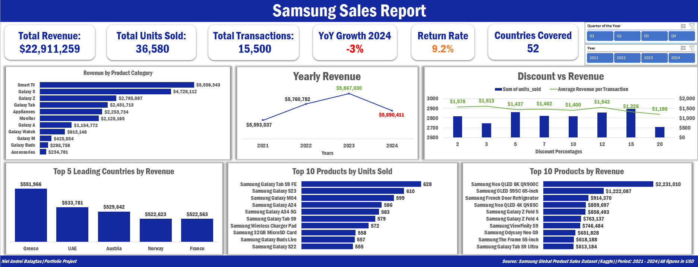

# 📱 Samsung Global Sales Data Analysis Project
### Tools Used: Microsoft Excel (PivotTables · Excel Charts · Slicers)

---

## 📋 Project Overview

[cite_start]An end-to-end data analysis project using a synthetic Samsung global product sales dataset from Kaggle[cite: 5]. [cite_start]The dataset represents global product sales transactions for Samsung across 52 countries from 2021 to 2024[cite: 5]. [cite_start]This project serves as a portfolio piece to demonstrate advanced data modeling, pivot operations, and dynamic dashboard creation capabilities within Microsoft Excel[cite: 5, 212].

[cite_start]Unlike my previous data science project where I utilized SQL for heavy data cleaning and programmatic transformation, this dataset was downloaded clean, full, and structured with no duplicate entries or formatting errors[cite: 8, 71, 72]. [cite_start]This allowed me to bypass complex data engineering pipelines and transition directly into the Exploratory Data Analysis (EDA) and dynamic visualization stage using Excel PivotTables[cite: 8, 74].

**Dataset Source:** [Samsung Global Product Sales Dataset – Kaggle](https://www.kaggle.com/datasets/ashyou09/samsung-global-product-sales-dataset?resource=download)

---

## 🔑 Key Findings

- [cite_start]**Total Revenue:** $22,911,259 accumulated over a 4-year transactional matrix (2021–2024)[cite: 146, 190].
- [cite_start]**Total Transactions:** 15,500 total orders processed globally[cite: 159, 190].
- [cite_start]**Total Units Sold:** 36,580 total units moved across 52 countries[cite: 147, 190].
- [cite_start]**Highest Revenue Category:** Smart TVs lead all product segments with $5,559,343 in revenue, heavily driven by high premium baseline unit pricing[cite: 192, 193]. 
- [cite_start]**Flagship Demand:** The Galaxy S smartphone series performed exceptionally well, generating $4,728,112 and proving consistent, volume-driven global consumer demand[cite: 192, 194].
- [cite_start]**Highest Revenue Item:** The *Samsung Neo QLED 8K QN900C* single-handedly brought in the highest individual product valuation at $2,231,010[cite: 200].
- [cite_start]**Best Selling Item (Volume):** The *Samsung Galaxy Tab S9 FE* led the entire global product catalog in raw volume with 628 units sold[cite: 200].
- [cite_start]**Lowest Revenue Category:** Accessories recorded the lowest total revenue at $234,781, proving that budget add-ons bring in the least money even when they sell in volume[cite: 193, 195].
- [cite_start]**Top Revenue Nations:** Out of 52 countries, the top 5 revenue-generating markets are Greece ($551,966), UAE ($533,781), Austria ($529,642), Norway ($522,623), and France ($522,563)[cite: 198].
- [cite_start]**Timeline Peak & Dip:** Global revenue grew steadily from 2021 ($5,593,037) to 2022 ($5,760,782) and peaked in 2023 at $5,867,030[cite: 197]. [cite_start]However, 2024 hit a minor -3% Year-over-Year decline, dropping to $5,690,411[cite: 161, 191, 197].
- [cite_start]**Discount Strategy Insight:** A minor 2% discount produced the highest average revenue per transaction ($1,578), while an aggressive 20% discount dropped that figure to $1,186[cite: 202]. [cite_start]Giving bigger discounts actively reduces overall revenue per transaction rather than driving profitable volume[cite: 203, 204].
- [cite_start]**Operational Risk Flag:** The business maintains a 9.2% overall product return rate, presenting a critical area for operational tracking and customer satisfaction audits[cite: 160, 191, 208].

---

## 🛠️ Project Steps

### 1. Data Inspection & Architecture (Excel)
* [cite_start]**Completeness Verification:** Confirmed all columns were properly filled with zero duplicate rows or structural data errors straight from download[cite: 71, 72]. 
* [cite_start]**Null Standardizations:** Isolated blank rows within the `customer_rating` column and converted them to true `null` values to preserve statistical integrity and remove bias from customer rating metrics[cite: 72].
* [cite_start]**Core Schema Evaluation:** Evaluated the dataset's structural dimensions encompassing fields across customer demographics, geographic locations, financial structures, and fulfillment paths[cite: 73]:
  > `sale_id`, `sale_date`, `year`, `quarter`, `month`, `country`, `region`, `city`, `product_name`, `category`, `storage`, `color`, `is_5g`, `unit_price_usd`, `discount_pct`, `units_sold`, `discounted_price_usd`, `revenue_usd`, `currency`, `fx_rate_to_usd`, `revenue_local_currency`, `sales_channel`, `payment_method`, `customer_segment`, `customer_age_group`, `previous_device_os`, `customer_rating`, `return_status`

### 2. Exploratory Data Analysis (Excel PivotTables)
[cite_start]Explored 13 specific business requirements using deep-dive Excel PivotTables to extract global operational intelligence[cite: 175]:
* [cite_start]Isolated the **Top 5 leading countries per month** by revenue parameters[cite: 177].
* [cite_start]Evaluated **Highest revenue items** versus **Highest sold items** to map price-volume matrices[cite: 178, 179].
* [cite_start]Cross-referenced **Customer segments** and **Age groups** to determine which consumer demographics spend more[cite: 181, 182].
* [cite_start]Profiled **5G adoption** rates across the top 10 countries[cite: 183].
* [cite_start]Analyzed **Sales channels** and **Discount percentages** against final revenue metrics to identify margin dilution[cite: 184, 186].
* [cite_start]Assessed **Customer ratings** against **Return status** to highlight product satisfaction friction points[cite: 185, 189].

### 3. Dashboard Design & Visualization (Excel)
[cite_start]Built a dynamic, executive-ready single-page workbook layout utilizing native Excel visualization features[cite: 174, 205]:
* [cite_start]**KPI Cards:** Trackers for Total Revenue, Total Units Sold, Total Transactions, YoY Growth 2024, Return Rate, and Countries Covered[cite: 146, 147, 159, 160, 161, 164].
* [cite_start]**Revenue by Product Category** (Horizontal Bar Chart tracking category valuations)[cite: 149].
* [cite_start]**Yearly Revenue Trends** (Line Chart tracking performance from 2021 to 2024)[cite: 162].
* [cite_start]**Discount vs. Revenue** (Column Chart mapping discount tiers against transactional yield)[cite: 165].
* [cite_start]**Top 5 Leading Countries by Revenue** (Column Chart highlighting primary local markets)[cite: 151].
* [cite_start]**Top 10 Products Profiles** (Dual Bar Charts parsing individual items by Units Sold and Total Revenue)[cite: 163, 169].
* [cite_start]**Interactive Slicers:** Connected across all data layers to allow stakeholders to dynamically drill down metrics by Quarter, Year, Region, and Product Categories[cite: 212].

---

## 📁 Files in this Repository

| File | Description |
|------|-------------|
| `samsung_global_sales_dataset_workbook` | [cite_start]Master Excel Workbook containing raw data, PivotTables, and the interactive dashboard [cite: 205, 212] |
| `Balagtas_Niel_Samsung_Sales_Documentation.pdf` | [cite_start]Verbatim project report documenting full methodology, analytical steps, and written insights [cite: 3] |
| `samsung-dashboard.png` | [cite_start]Main interface screen capture focusing on the interactive sales dashboard overview [cite: 174] |

---

## 📊 Dashboard Preview

---

## 💡 Conclusions & Strategic Recommendations

[cite_start]Based on the 4-year transaction data, Samsung's global sales channels are on a generally healthy and stable track[cite: 206]. [cite_start]Premium offerings like Smart TVs and flagship Galaxy S smartphones serve as the foundational bedrock for global revenue generation[cite: 207]. 

To optimize performance moving into the future, the business should focus on three strategic areas:
1. [cite_start]**Enforce Pricing Guardrails:** Discontinue deep promotional discounts (e.g., 20%), as they drastically dilute revenue yield per transaction[cite: 204, 209]. [cite_start]Minor incentives (e.g., 2%) are vastly more efficient at preserving product value and profit margins[cite: 202].
2. [cite_start]**Investigate the 2024 Revenue Contraction:** The -3% YoY decline in 2024 should be thoroughly audited alongside the 9.2% return rate to identify whether specific product batches are experiencing quality control issues or waning customer satisfaction[cite: 208].
3. [cite_start]**Geographic Focus:** Double down on localized marketing campaigns, distribution lines, and inventory prioritization within elite, proven revenue-generating countries like Greece, UAE, and Austria[cite: 210].

> [cite_start]**Note:** This is a synthetic dataset used for portfolio and practice purposes[cite: 211]. [cite_start]The analytical workflow and execution mirror exactly how I treat real-world corporate business intelligence data[cite: 211].

---

## 👤 Author

**Niel Andrei Balagtas**
- 📧 nielandreibalagtas@gmail.com
- 💼 [LinkedIn](https://www.linkedin.com/in/niel-andrei-balagtas-360442379/)
- 🐙 [GitHub](https://github.com/nielandreibalagtas)

---
